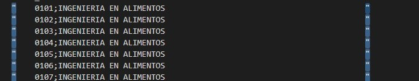

# Resolucion del Punto 2: 
### Pasos para la extraccion: 

+ Primero se tomaron las fuentes de datos: 
    - etl_estudiantes.csv 
    - 01-02-planes.txt

### CARGA DE LAS TABLAS: Sedes, Sexo, Ciudad y Cohorte
En este primer archivo (etl_estudiantes.csv), 
* Se hicieron tranformaciones, sacando columnas no importantes
* Dividiendo de esta forma en cuatro flujos de tranformacion

### CARGA DE LA TABLA PLANES: 
* Para la extraccion de informacion del segundo archivo [01-02-planes.txt](data/01-02-planes.txt), fue un poco mas dificultosa, en el sentido que los espacios entre ambas columnas, no permitian de una forma sencilla parsear los datos. 
En este sentido una vez cargado en Spoon y pasado por el "Replace in String" fue exportado al archivo 
- [salida._planes.txt](data/salida_planes.txt) : que aun asi, me dejo en la salida comillas en los extremos, que pude sacar rapidamente con la herrmienta que la IDE de Visual Studio proporciona CTRL + F2
- 
- Y ahora si, paso al siguiente paso en la transformacion y carga de la tabla Planes...

### CARGA TABLA RENDIMIENTO ACADEMICO
##### Extraccion del archivo [01-02-etl_cursadas.sql](data/01-02-etl_cursadas.sql) para la creacion de la Tabla Rendimiento Academico.

+ En esta ultima etapa de extraccion, se necesita reemplazar los valores de las Columnas Plan, Sede, Ciudad, Sexo y Cohorte y  por sus correspondientes IDs, generados en los pasos anteriormente descriptos. 

Asimismo hay que agregar 3 columnas calculas correspondientes a: 
- La cantidad de asignaturas cursadas
- La cantidad de asignaturas aprobadas
- El promedio de las asignaturas aprobadas. 

+ En este paso tuve que crear 6 vistas en la base de datos:     

- cantidad_aprobadas: estudiantes que aprobaron al menos una materia

    |    Columna     |    
    | -------------- |
    | id_estudiante  |
    |    count       |

- cantidad_cursadas: aca considero a todos los estudiantes, en total 19465 estudiantes

    |    Columna     |    
    | -------------- |
    | id_estudiante  |
    |    count2      |

- con_asign_aprob_y_sin_asign_aprob: aca esta el conjunto de estudiantes que no aprobaron ninguna materia UNION estudiantes que aprobaron al menos una materia. 

    |    Columna     |    
    | -------------- |
    | id_estudiante  |
    |    count3      |

- estudiantes_sin_asignaturas_aprobadas: conjunto de estudiantes queno aprobaron ninguna materia. 

    |    Columna     |
    | -------------- |
    | id_estudiante  |
    |    count2      |

- promedio_aprobadas: solo estudiantes que aprobaron al menos una materia

    |    Columna     |
    | -------------- |
    | id_estudiante  |
    |    count3      |

- union_prom_aprob_y_cant_cursadas: aqui tengo la union de promedio de estudiantes que aprobaron al menos una materia con estudiantes que no aprobaron ninguna materia. 

Esto es asi, para que luego al momento de interactuar con Pentaho, solo tengamos que cargar las tablas por table_input y hacer los correpondientes merge join entre tablas. 

Consideraciones que se dieron durante el diseño:
-  En los merge join: ambas tablas debian estar ordenadas. 

