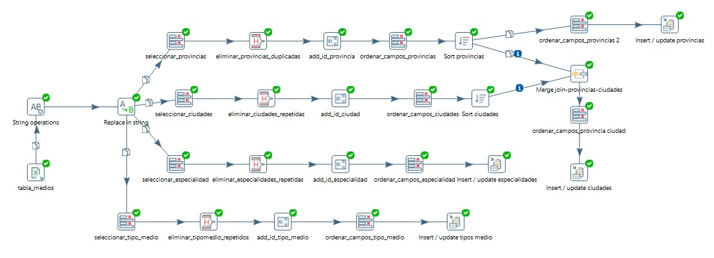
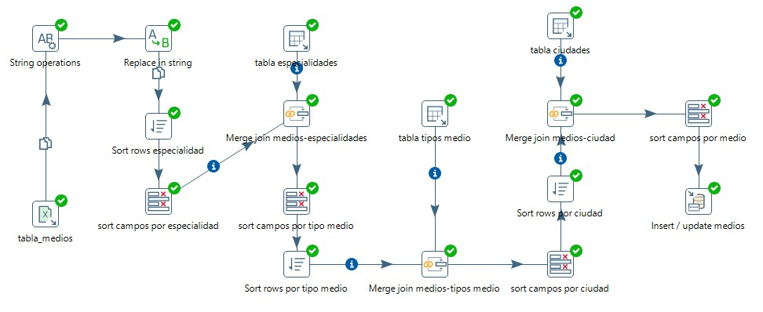

### 3. Ahora, resuelva la consigna 1) con la herramienta PDI de la suite Pentaho, a través de las transformations y Jobs necesarias para llevar adelante la solución. Tome el tiempo que demora en resolver este ejercicio con PDI.

    a. Medios(id, nombre, id_especialidad, id_tipo_medio, dirección, id_ciudad),
    b. Especialidades(id, descripción),
    c. Tipos_medio(id, descripción),
    d. Ciudades(id, nombre, id_provincia).
    e. Provincias(id, nombre).

#### Respuesta: 

+ Centralize el trabajo, dividiendo en dos partes: 

1

##### Extraccion Transformacion y carga de las Tablas 
- Especialidades 
- Tipos Medio
- Ciudades 
- Provincias

##### Para luego hacer la extraccion transformacion y carga de la tabla medios

